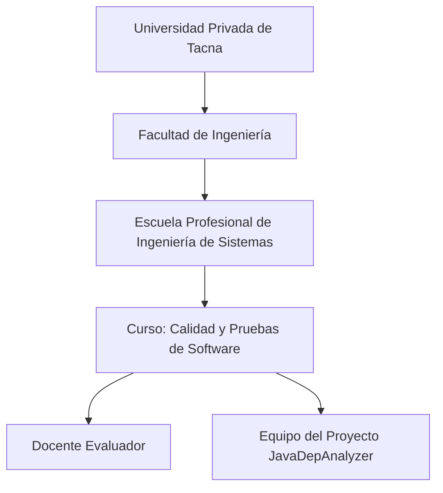
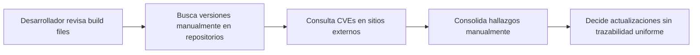
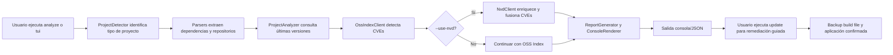
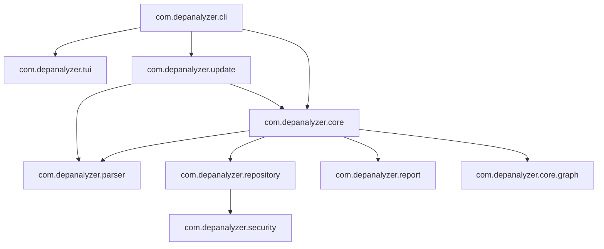
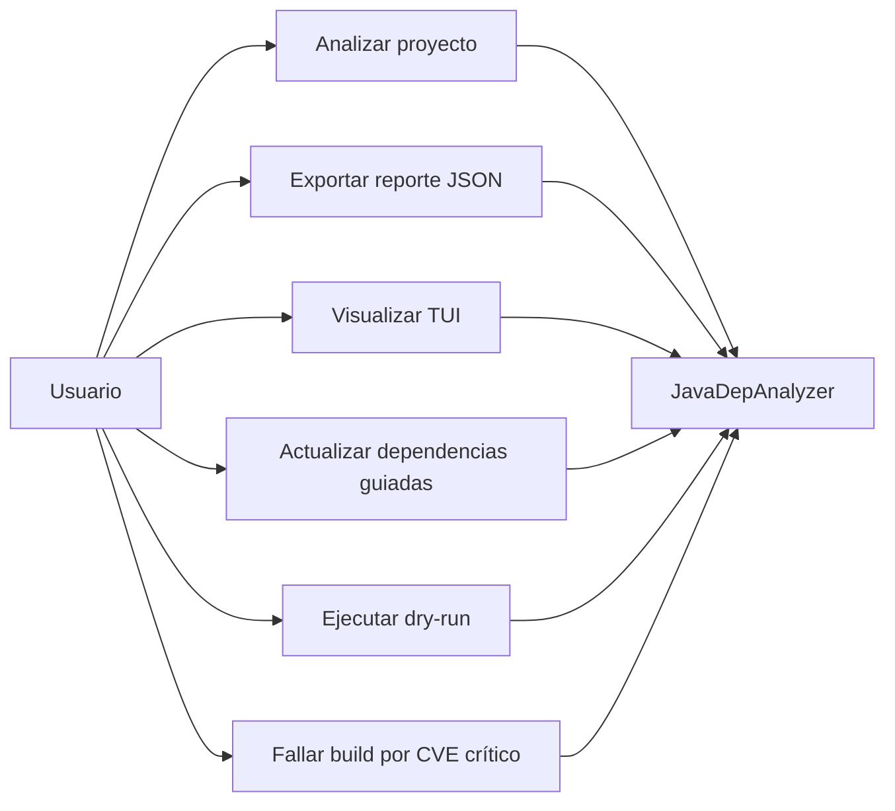
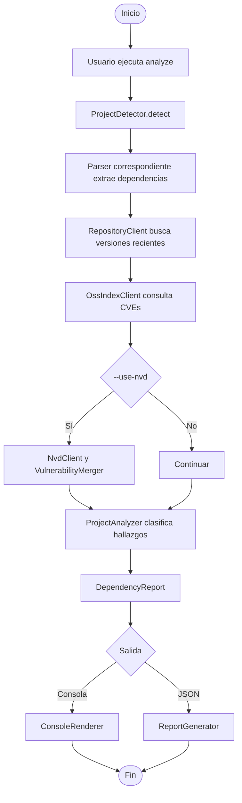
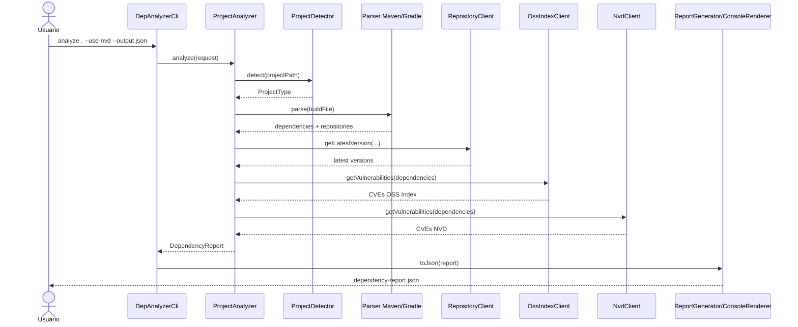
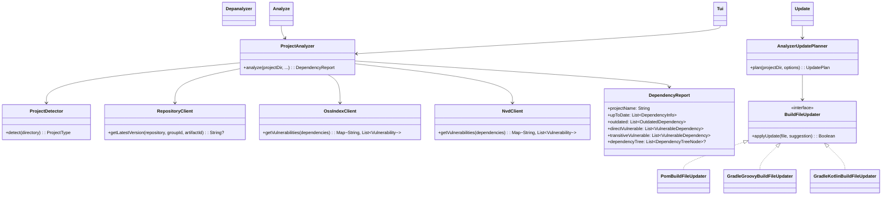

**UNIVERSIDAD PRIVADA DE TACNA**

**FACULTAD DE INGENIERÍA**

**Escuela Profesional de Ingeniería de Sistemas**

**Proyecto *Analizador de Dependencias Java***

Curso: *Calidad y Pruebas de Software*

Docente: *Patrick Cuadros Quiroga*

Integrantes:

***Carbajal Vargas, Andre Alejandro (2023077287)***

***Yupa Gómez, Fátima Sofía (2023076618)***

**Tacna – Perú**

***2026***

\pagebreak

Sistema *Analizador de Dependencias Java (JavaDepAnalyzer)*

Informe de Especificación de Requerimientos

Versión *1.0*

| CONTROL DE VERSIONES |           |              |               |            |                 |
|:--------------------:|:----------|:-------------|:--------------|:-----------|:----------------|
| Versión              | Hecha por | Revisada por | Aprobada por  | Fecha      | Motivo          |
| 1.0                  | ACV, FYG  | ACV, FYG     | P. Cuadros Q. | 2026-04-22 | Versión inicial |

# ÍNDICE GENERAL

1. [Introducción](#1-introducción)
2. [Generalidades de la Empresa](#2-generalidades-de-la-empresa)
    1. [Nombre de la Empresa](#21-nombre-de-la-empresa)
    2. [Visión](#22-visión)
    3. [Misión](#23-misión)
    4. [Organigrama](#24-organigrama)
3. [Visionamiento de la Empresa](#3-visionamiento-de-la-empresa)
    1. [Descripcion del problema](#31-descripcion-del-problema)
    2. [Objetivo de Negocios](#32-objetivo-de-negocios)
    3. [Objetivo de diseño](#33-objetivo-de-diseño)
    4. [Alcance del proyecto](#34-alcance-del-proyecto)
    5. [Viabilidad del sistema](#35-viabilidad-del-sistema)
    6. [Informacion obtenida del Levantamiento de informacion](#36-informacion-obtenida-del-levantamiento-de-informacion)
4. [Analisis de procesos](#4-analisis-de-procesos)
    1. [Diagrama de Procesos Actual](#41-diagrama-de-procesos-actual)
    2. [Diagrama de Procesos Propuesto](#42-diagrama-de-procesos-propuesto)
5. [Especificacion de Requerimientos de Software](#5-especificacion-de-requerimientos-de-software)
    1. [Cuadro de Requerimientos funcionales Inicial](#51-cuadro-de-requerimientos-funcionales-inicial)
    2. [Cuadro de Requerimientos no funcionales](#52-cuadro-de-requerimientos-no-funcionales)
    3. [Cuadro de Requerimientos funcionales Final](#53-cuadro-de-requerimientos-funcionales-final)
    4. [Regla de Negocio](#54-regla-de-negocio)
6. [Fase de Desarrollo](#6-fase-de-desarrollo)
    1. [Perfil del Usuario](#61-perfil-del-usuario)
    2. [Modelo Conceptual](#62-modelo-conceptual)
        1. [Diagrama de paquetes](#621-diagrama-de-paquetes)
        2. [Diagrama de casos de uso](#622-diagrama-de-casos-de-uso)
        3. [Escenarios de casos de uso (narrativas)](#623-escenarios-de-casos-de-uso-narrativas)
    3. [Modelo Lógico](#63-modelo-lógico)
        1. [Analisis de Objetos](#631-analisis-de-objetos)
        2. [Diagrama de Actividades con objetos](#632-diagrama-de-actividades-con-objetos)
        3. [Diagrama de secuencia](#633-diagrama-de-secuencia)
        4. [Diagrama de clases](#634-diagrama-de-clases)
7. [Conclusiones](#7-conclusiones)
8. [Recomendaciones](#8-recomendaciones)
9. [Bibliografia](#9-bibliografia)
10. [Webgrafia](#10-webgrafia)

\pagebreak

# 1. Introducción

El presente Informe de Especificación de Requerimientos de Software (ERS) define, de manera verificable, las capacidades funcionales y no funcionales del sistema *JavaDepAnalyzer*. Este documento integra la visión académica del proyecto (FD02), la factibilidad evaluada (FD01) y el estado actual del código fuente para asegurar trazabilidad real entre requisitos, implementación y pruebas.

El sistema está orientado a analizar proyectos Java (Maven y Gradle), identificar dependencias desactualizadas, detectar vulnerabilidades CVE y brindar mecanismos de actualización guiada en terminal, con confirmación explícita y respaldo de archivos de build.

# 2. Generalidades de la Empresa

## 2.1 Nombre de la empresa

Universidad Privada de Tacna – Facultad de Ingeniería – Escuela Profesional de Ingeniería de Sistemas.

## 2.2 Visión

Formar profesionales líderes, innovadores y comprometidos con la calidad, capaces de desarrollar soluciones tecnológicas aplicadas a problemas reales del entorno.

## 2.3 Misión

Brindar formación integral en ingeniería de software, promoviendo investigación aplicada, ética profesional y producción de software de calidad con impacto académico y social.

## 2.4 Organigrama

# 3. Visionamiento de la Empresa

## 3.1 Descripcion del problema

En proyectos Java modernos, la gestión manual de dependencias presenta dos fallas frecuentes: (a) atraso de versiones con deuda técnica acumulada y (b) exposición a CVEs en dependencias directas y transitivas. La revisión manual no escala para árboles de dependencias medianos o grandes y dificulta tomar decisiones oportunas de mantenimiento.

## 3.2 Objetivo de negocios

Reducir tiempo de diagnóstico técnico y riesgo de seguridad en proyectos Java, proporcionando una herramienta CLI/TUI que entregue evidencia rápida, trazable y accionable para mantenimiento de dependencias.

## 3.3 Objetivo de diseño

Diseñar una solución modular en Kotlin/JVM que:

- detecte automáticamente tipo de proyecto,
- parsee dependencias y repositorios,
- consulte versiones y CVEs (OSS Index y enriquecimiento NVD opcional),
- emita reportes legibles y JSON,
- y habilite actualización interactiva con respaldo previo.

## 3.4 Alcance del proyecto

**Incluido en la versión actual:**

- Análisis de proyectos Maven (`pom.xml`), Gradle Groovy (`build.gradle`) y Gradle Kotlin (`build.gradle.kts`).
- Comandos CLI `analyze`, `tui` y `update`.
- Detección de desactualización por consulta de metadatos de repositorios.
- Detección de CVEs con OSS Index y enriquecimiento opcional con NVD (`--use-nvd`).
- Clasificación de vulnerabilidades directas/transitivas y renderizado en árbol.
- Exportación de resultados en JSON (`--output json`).
- Actualización guiada con confirmación interactiva y backup automático (`.bak`).

**Fuera de alcance en la versión actual:**

- Interfaz gráfica web/escritorio.
- Actualización automática sin confirmación del usuario.
- Reemplazo total de suites SCA empresariales de pago.

## 3.5 Viabilidad del sistema

Con base en FD01, la viabilidad del sistema es **alta** en dimensiones técnica, operativa, legal, social y ambiental. El costo operativo del entorno académico es bajo, y la pila tecnológica empleada es open-source, madura y documentada.

## 3.6 Informacion obtenida del levantamiento de informacion

Fuentes de entrada para este ERS:

- Documento de factibilidad (`docs/FD01-Informe-Factibilidad.md`).
- Documento de visión (`docs/FD02-Informe-Vision.md`).
- Código fuente del sistema (módulos `cli`, `core`, `parser`, `repository`, `report`, `update`, `tui`).
- README y workflows de CI/CD del repositorio.

# 4. Analisis de procesos

## 4.1 Diagrama de procesos actual

Proceso manual sin herramienta integrada.

## 4.2 Diagrama de procesos propuesto

Proceso automatizado con JavaDepAnalyzer.

# 5. Especificacion de Requerimientos de Software

## 5.1 Cuadro de requerimientos funcionales inicial

| ID | Requerimiento funcional inicial | Criterio general de aceptación |
|---|---|---|
| RFI-01 | Detectar tipo de proyecto Java | Identifica Maven, Gradle Groovy o Gradle Kotlin con archivos estándar |
| RFI-02 | Extraer dependencias declaradas | Obtiene `groupId:artifactId:version` según parser correspondiente |
| RFI-03 | Extraer repositorios del proyecto | Lee repos configurados para consultar versiones |
| RFI-04 | Detectar desactualizaciones | Compara versión actual vs versión más reciente |
| RFI-05 | Detectar CVEs | Consulta vulnerabilidades por dependencia |
| RFI-06 | Clasificar vulnerabilidades | Separa vulnerabilidades directas y transitivas |
| RFI-07 | Mostrar resultados por consola | Presenta resumen legible y árbol de problemas |
| RFI-08 | Exportar JSON | Genera reporte estructurado para automatización |

## 5.2 Cuadro de requerimientos no funcionales

| ID | Requerimiento no funcional | Métrica / Umbral | Evidencia esperada |
|---|---|---|---|
| RNF-01 | Portabilidad | Ejecución en Windows, Linux y macOS | Scripts generados por `installDist` y release nativo |
| RNF-02 | Usabilidad técnica | Comandos con ayuda y flags consistentes | `--help`, documentación en README |
| RNF-03 | Confiabilidad | Manejo controlado de errores de red/parseo | No abortar todo el flujo por fallo parcial de fuente externa |
| RNF-04 | Seguridad de credenciales | Solo enviar credenciales a hosts confiables por allowlist | `DEPANALYZER_TRUSTED_CREDENTIAL_HOSTS` aplicado |
| RNF-05 | Interoperabilidad | JSON válido y estable para consumo externo | `--output json` parseable por scripts |
| RNF-06 | Rendimiento | Tiempo razonable en proyectos medianos (objetivo <= 30s local) | Corridas de referencia y pruebas internas |
| RNF-07 | Mantenibilidad | Arquitectura modular y tipada | Separación de paquetes y cobertura de tests |
| RNF-08 | Auditabilidad | Evidencia repetible en CI/CD | Workflows de test y release definidos |

## 5.3 Cuadro de requerimientos funcionales final

| ID | Requerimiento funcional final | Prioridad | Trazabilidad técnica (módulo/código) |
|---|---|---|---|
| RF-01 | Detectar automáticamente tipo de proyecto (`pom.xml`, `build.gradle`, `build.gradle.kts`) | Alta | `parser/ProjectDetector.kt` |
| RF-02 | Parsear dependencias Maven y Gradle | Alta | `parser/PomDependencyParser.kt`, `parser/GradleGroovyDependencyParser.kt`, `parser/GradleKotlinDependencyParser.kt` |
| RF-03 | Parsear repositorios del proyecto | Alta | `parser/GradleRepositoryParser.kt`, `parser/PomDependencyParser.kt` |
| RF-04 | Consultar versión más reciente por repositorio | Alta | `repository/RepositoryClient.kt`, `core/ProjectAnalyzer.kt` |
| RF-05 | Detectar CVEs usando OSS Index | Alta | `repository/OssIndexClient.kt`, `core/ProjectAnalyzer.kt` |
| RF-06 | Enriquecer CVEs con NVD (opcional) | Media | `repository/NvdClient.kt`, `repository/VulnerabilityMerger.kt`, flag `--use-nvd` |
| RF-07 | Clasificar vulnerabilidades directas y transitivas | Alta | `core/ProjectAnalyzer.kt`, `report/DependencyReport.kt` |
| RF-08 | Mostrar resultados en consola con árbol de dependencias | Alta | `report/ConsoleRenderer.kt`, `report/DependencyTreeBuilder.kt` |
| RF-09 | Exportar resultados a JSON | Alta | `report/ReportGenerator.kt`, opción `--output json` |
| RF-10 | Ofrecer interfaz TUI interactiva | Media | `tui/AnalyzeTuiApp.kt`, comando `tui` y flag `--tui` |
| RF-11 | Ejecutar actualización guiada con selección interactiva | Alta | `cli/UpdateCommand.kt`, `update/UpdatePlanner.kt` |
| RF-12 | Respaldar build file antes de aplicar cambios | Alta | `update/BuildFileBackup.kt` |
| RF-13 | Simular cambios sin modificar archivos (`--dry-run`) | Media | `cli/UpdateCommand.kt` |
| RF-14 | Fallar proceso en CI ante CVEs críticos (`--fail-on-critical`) | Media | `cli/DepAnalyzerCli.kt` |

## 5.4 Regla de negocio

| ID | Regla de negocio | Aplicación |
|---|---|---|
| RN-01 | Ninguna actualización de dependencia se aplica sin confirmación interactiva del usuario | Flujo `update` y flujo de actualización en TUI |
| RN-02 | Antes de modificar `pom.xml` / `build.gradle` / `build.gradle.kts` se genera backup `.bak` | `BuildFileBackup.ensureBackup` |
| RN-03 | En caso de error de fuente externa (OSS Index/NVD), el análisis continúa con degradación controlada | Manejo de excepciones en `ProjectAnalyzer` |
| RN-04 | Si se usan credenciales de repositorio, solo se envían a destinos HTTPS confiables explícitos | `InputSafety.isTrustedCredentialDestination` |
| RN-05 | En conflictos de token OSS Index, el token CLI tiene prioridad sobre variable de entorno | `--oss-index-token` vs `OSS_INDEX_TOKEN` |
| RN-06 | El modo TUI prioriza cobertura dinámica de transitivas para análisis interactivo | Forzado de análisis dinámico en TUI |

# 6. Fase de Desarrollo

## 6.1 Perfil del usuario

| Perfil | Características | Necesidades principales |
|---|---|---|
| Usuario técnico básico | Usa terminal para comandos directos | Diagnóstico rápido en consola |
| Usuario técnico intermedio | Integra herramientas con scripts | Salida JSON y parámetros de control |
| Usuario técnico avanzado/CI | Automatiza control de calidad y seguridad | Exit code controlado y reportes estables |
| Mantenedor académico | Evalúa trazabilidad y evidencia | Coherencia entre documentos, código y pruebas |

## 6.2 Modelo Conceptual

### 6.2.1 Diagrama de paquetes

### 6.2.2 Diagrama de casos de uso

### 6.2.3 Escenarios de casos de uso (narrativas)

| Caso de uso | Actor | Flujo principal | Resultado |
|---|---|---|---|
| CU-01 Analizar proyecto | Usuario | Ejecuta `analyze <ruta>`; el sistema detecta tipo, parsea, consulta versiones/CVEs y renderiza | Reporte en consola con estado de dependencias |
| CU-02 Exportar JSON | Usuario | Ejecuta `analyze <ruta> --output json` | Se genera `dependency-report.json` |
| CU-03 Analizar con TUI | Usuario | Ejecuta `tui <ruta>` o `analyze --tui`; el sistema muestra progreso y paneles interactivos | Visualización interactiva de hallazgos |
| CU-04 Actualizar dependencias | Usuario | Ejecuta `update <ruta>`; selecciona sugerencias; confirma | Build file actualizado y backup creado |
| CU-05 Simular actualización | Usuario | Ejecuta `update --dry-run`; selecciona sugerencias | Resumen de cambios simulados sin modificar archivos |

## 6.3 Modelo Lógico

### 6.3.1 Analisis de objetos

| Objeto | Responsabilidad | Tipo |
|---|---|---|
| `ProjectAnalyzer` | Orquestar análisis de dependencias, versiones y vulnerabilidades | Control |
| `ProjectDetector` | Detectar tipo de proyecto por archivos build | Entidad de soporte |
| `PomDependencyParser` / `Gradle*DependencyParser` | Extraer dependencias y metadatos por formato | Servicio parser |
| `RepositoryClient` | Consultar metadatos de versión en repositorios | Servicio infraestructura |
| `OssIndexClient` / `NvdClient` | Consultar vulnerabilidades y enriquecer CVEs | Servicio integración externa |
| `DependencyReport` | Representar resultado consolidado de análisis | DTO de dominio |
| `ReportGenerator` / `ConsoleRenderer` | Transformar reporte a JSON o salida legible | Presentación |
| `AnalyzerUpdatePlanner` | Planificar sugerencias de actualización | Lógica de negocio |
| `BuildFileUpdater` (+ implementaciones) | Aplicar cambios por tipo de build file | Estrategia |
| `BuildFileBackup` | Crear respaldo previo a modificaciones | Seguridad operativa |

### 6.3.2 Diagrama de actividades con objetos

### 6.3.3 Diagrama de secuencia

### 6.3.4 Diagrama de clases

# 7. Conclusiones

1. El ERS define requerimientos verificables y trazables al código real del proyecto, reduciendo ambigüedad documental.
2. El núcleo funcional del sistema cumple el objetivo académico: análisis integral de dependencias, versiones y vulnerabilidades.
3. La presencia de `update` y TUI confirma un alcance de remediación guiada (no automática), con controles de seguridad operativa.
4. Los requisitos no funcionales priorizan portabilidad, seguridad de credenciales, interoperabilidad y auditabilidad en CI/CD.
5. La arquitectura modular facilita mantenimiento, pruebas y evolución incremental del sistema.

# 8. Recomendaciones

1. Mantener sincronizados FD01, FD02, FD03 y README al cerrar cada sprint o hito académico.
2. Agregar una matriz formal requisito → prueba automatizada para evaluación docente y auditoría interna.
3. Establecer línea base de rendimiento por tipo/tamaño de proyecto para medir regresiones.
4. Fortalecer pruebas de escenarios no estándar de Gradle y repositorios privados con autenticación.
5. Definir en siguiente iteración un historial comparativo entre ejecuciones para seguimiento temporal de riesgo.

# 9. Bibliografia

1. Pressman, R. S., & Maxim, B. R. (2020). *Software Engineering: A Practitioner's Approach*.
2. Sommerville, I. (2016). *Software Engineering*.
3. ISO/IEC 25010:2011. *Systems and software quality models*.
4. Sonatype. (2026). *OSS Index Documentation*.
5. NIST. (2026). *National Vulnerability Database (NVD) Developers Guide*.
6. Apache Software Foundation. (2026). *Maven Documentation*.
7. Gradle Inc. (2026). *Gradle User Manual*.
8. JetBrains. (2026). *Kotlin Documentation*.

# 10. Webgrafia

- Repositorio del proyecto: `README.md`
- Configuración build: `build.gradle.kts`
- CLI principal: `src/main/kotlin/com/depanalyzer/cli/DepAnalyzerCli.kt`
- Comando de actualización: `src/main/kotlin/com/depanalyzer/cli/UpdateCommand.kt`
- Orquestador de análisis: `src/main/kotlin/com/depanalyzer/core/ProjectAnalyzer.kt`
- Parsers: `src/main/kotlin/com/depanalyzer/parser/`
- Repositorios y CVE clients: `src/main/kotlin/com/depanalyzer/repository/`
- Reportes: `src/main/kotlin/com/depanalyzer/report/`
- Workflows CI/CD: `.github/workflows/test.yml`, `.github/workflows/release-native.yml`
- https://ossindex.sonatype.org/
- https://nvd.nist.gov/developers
- https://maven.apache.org/
- https://docs.gradle.org/
- https://kotlinlang.org/docs/home.html
